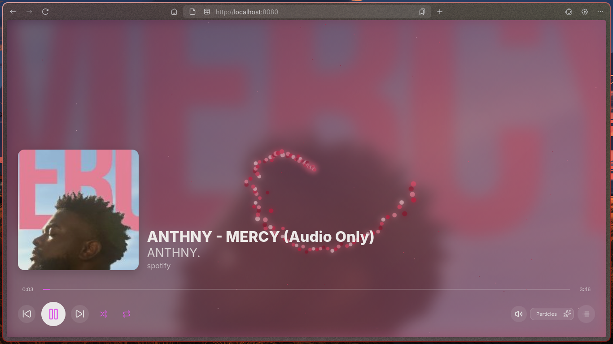
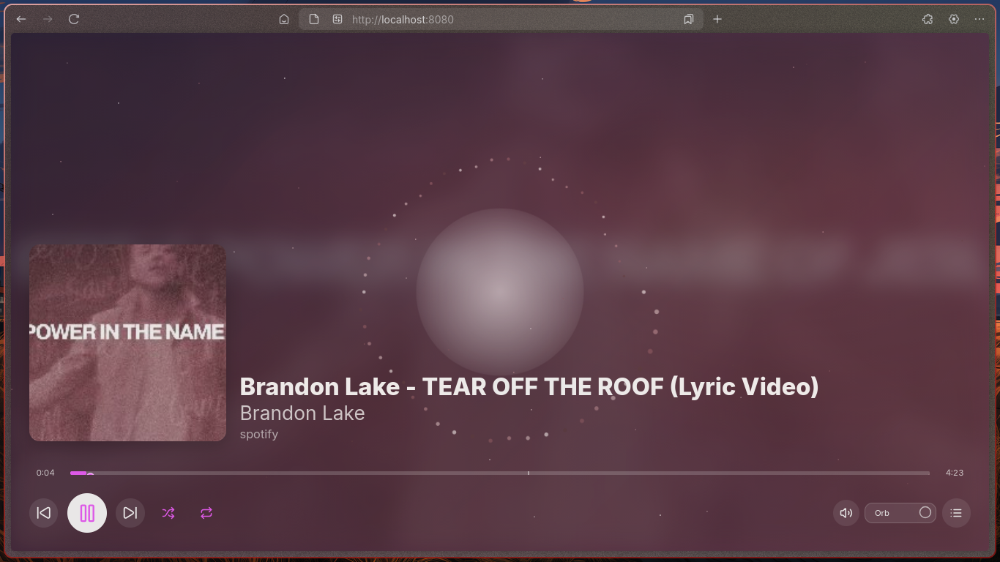
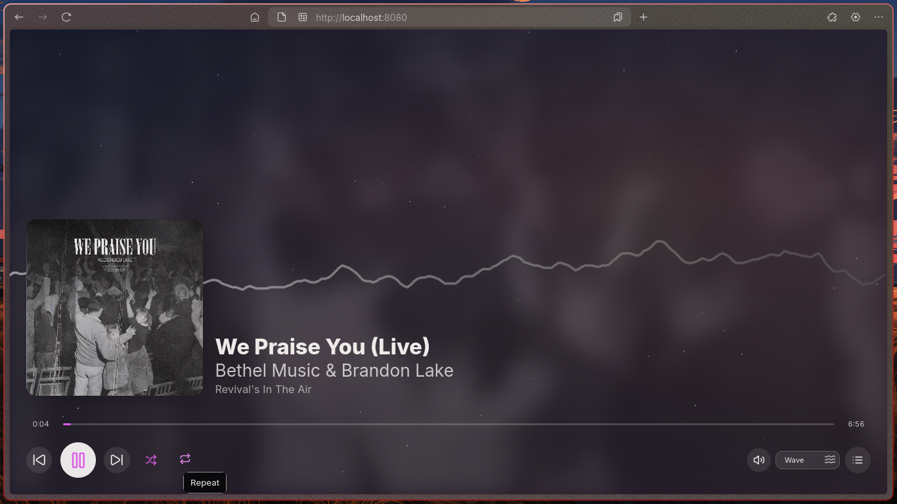
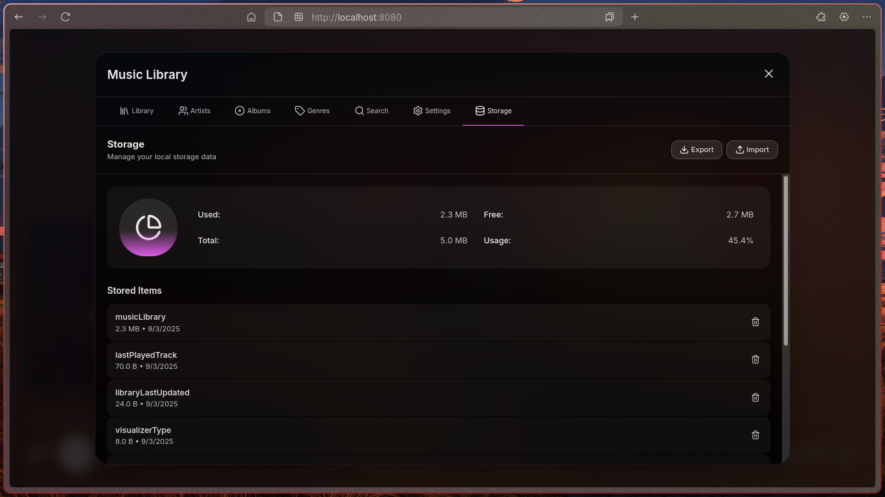
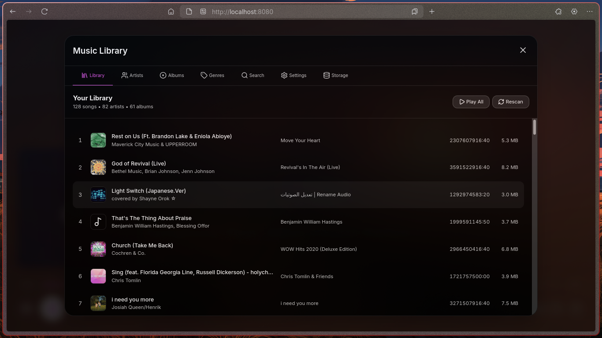
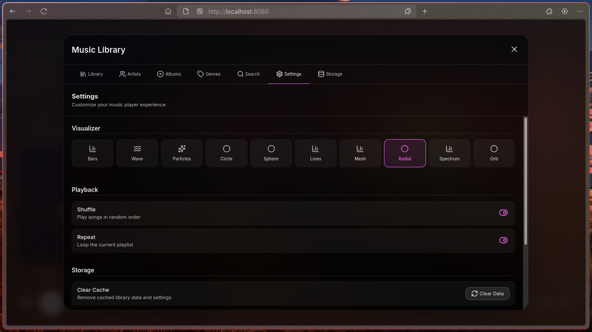

# bpv

browser based local music player

**BPV** is a lightweight, customizable, browser-based local music player built with **Go**, **TypeScript**, **React**, and **Vite**. It features stunning visualizers, smooth performance, and an intuitive interface, While being resource-efficient and easy to use.

---

---

## Screenshots

| Screenshot 1                        | Screenshot 2                        | Screenshot 3                        |
| ----------------------------------- | ----------------------------------- | ----------------------------------- |
|  |  |  |

| Screenshot 4                        | Screenshot 5                        | Screenshot 6                        |
| ----------------------------------- | ----------------------------------- | ----------------------------------- |
|  |  |  |

---

## Quick Start

### Development Setup

1. **Start the Go backend** (replace `folder-path` with your music directory):

```bash
go run main.go serve folder-path
```

2. **Start the React frontend**:

```bash
cd web/
npm install
npm run dev
```

3. Open your browser and visit: [http://localhost:3000](http://localhost:3000)

---

### Production Build

To build and run BPV in production mode:

1. **Build the Go binary**:

```bash
go build -o bpv main.go
```

2. **Run the backend with your music directory**:

```bash
./bpv serve folder-path
```

3. **Build the frontend**:

```bash
cd web/
npm install
npm run build
```

4. Open the local web interface served by the Go binary.

---

## Contribution

Contributions are welcome! Infact pls contribute by any means you can.

## License

MIT License
